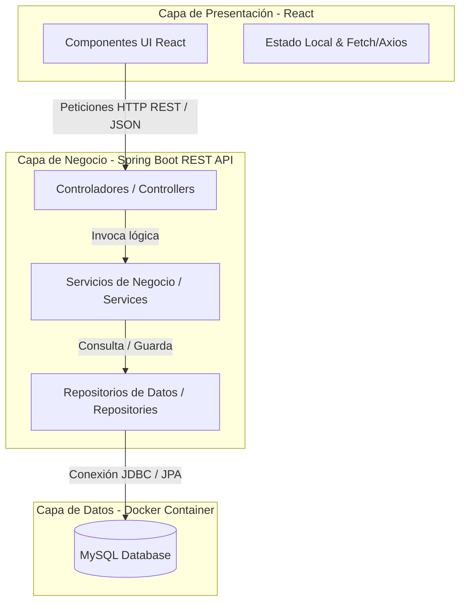

# Arquitectura del Sistema

El sistema **FutManager** está diseñado bajo una arquitectura desacoplada Cliente-Servidor (SPA + API REST) para asegurar la modularidad y facilitar el mantenimiento independiente de cada componente.

---

## 🏗️ Diagrama de Arquitectura General

El flujo de comunicación de la aplicación sigue el siguiente esquema:

---

## 💻 Capa del Frontend (React SPA)

- **Tecnología Principal:** React (SPA, inicializado opcionalmente con Vite).
- **Estilos:** CSS Vanilla para un diseño personalizado, dinámico y premium sin dependencias pesadas de frameworks CSS externos.
- **Comunicación:** Peticiones HTTP asíncronas (`fetch` o `axios`) consumiendo los endpoints de la API REST expuesta por el backend.
- **Funcionalidades Clave:**
  - Panel interactivo de gestión (CRUD).
  - Renderizado visual interactivo de cartas FUT.
  - Componente de visualización de resultados de JUnit consumiendo `/api/test-results`.

---

## ⚙️ Capa del Backend (Spring Boot)

El backend sigue un diseño de **Arquitectura en Capas** convencional, asegurando la separación de responsabilidades:

1. **Capa del Controlador (Controller):**
   - Clase anotada con `@RestController`.
   - Expone los endpoints HTTP.
   - Maneja la serialización/deserialización de JSON.
   - Gestiona las respuestas HTTP y los códigos de estado apropiados (`200 OK`, `201 Created`, `400 Bad Request`, `444 Not Found`, etc.).
2. **Capa de Servicio (Service):**
   - Clase anotada con `@Service`.
   - Contiene la lógica de negocio del negocio (por ejemplo, validación de estadísticas de cartas antes de guardar).
   - Actúa como intermediario entre el controlador y la base de datos.
3. **Capa de Repositorio (Repository):**
   - Interfaz anotada con `@Repository` que extiende `JpaRepository`.
   - Abstrae el acceso a datos mediante Spring Data JPA.
   - Define consultas personalizadas o métodos de búsqueda derivados.
4. **Capa de Entidad (Entity):**
   - Clases anotadas con `@Entity` que representan las tablas de la base de datos MySQL.
   - Utilizan anotaciones JPA (`@Id`, `@GeneratedValue`, `@ManyToOne`, `@OneToOne`, etc.) para definir el esquema de datos y las relaciones.

---

## 🗄️ Capa de Base de Datos (MySQL en Docker)

- **Motor de Base de Datos:** MySQL 8.x.
- **Entorno:** Contenedor de Docker gestionado por Docker Compose.
- **Acceso:** Spring Boot se conecta a la base de datos utilizando el driver de conexión JDBC de MySQL y gestiona la estructura de las tablas dinámicamente mediante Hibernate (`spring.jpa.hibernate.ddl-auto=update` o similar).
