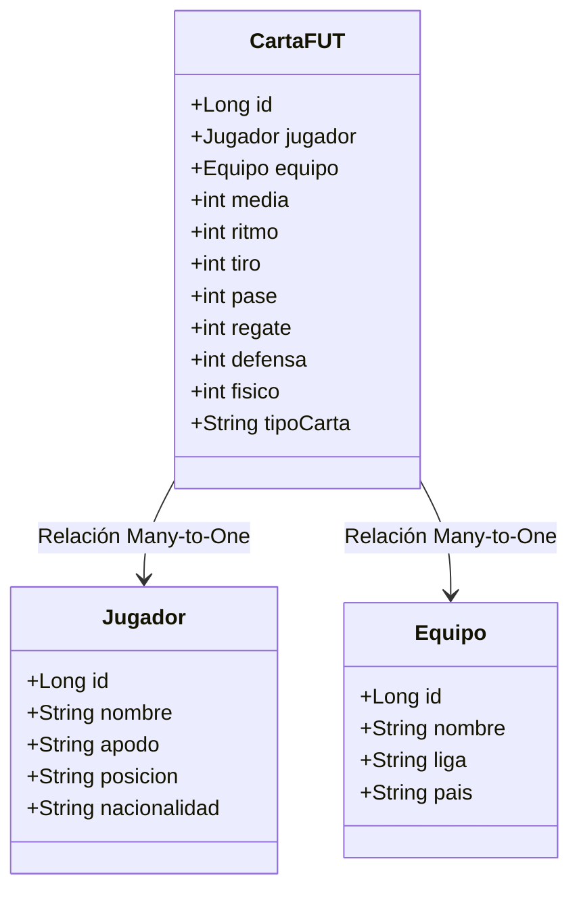

# Especificación del Backend (API REST)

El backend de **FutManager** se desarrollará utilizando **Spring Boot**. Se encargará de gestionar el almacenamiento, la lógica de negocio y de exponer un API REST completo para que el cliente React interactúe con los datos de forma segura.

---

## 🗃️ Modelo de Dominio (Entidades JPA)

Se deben crear las siguientes tres entidades con sus respectivas relaciones:



### 1. Entidad `Jugador`
- **Atributos:**
  - `id` (Long, Autoincremental, Primary Key)
  - `nombre` (String, No nulo)
  - `apodo` (String, Opcional)
  - `posicion` (String, No nulo - ej. POR, DFC, MC, DC)
  - `nacionalidad` (String, No nulo)

### 2. Entidad `Equipo`
- **Atributos:**
  - `id` (Long, Autoincremental, Primary Key)
  - `nombre` (String, No nulo)
  - `liga` (String, No nulo - ej. "Liga Española", "Liga Italiana")
  - `pais` (String, No nulo)

### 3. Entidad `CartaFUT`
- **Atributos:**
  - `id` (Long, Autoincremental, Primary Key)
  - `jugador` (Asociación `@ManyToOne` con `Jugador`, No nulo)
  - `equipo` (Asociación `@ManyToOne` con `Equipo`, No nulo)
  - `media` (int, Rango [0-99], Representa el valor general/rating)
  - `ritmo` (int, Rango [0-99])
  - `tiro` (int, Rango [0-99])
  - `pase` (int, Rango [0-99])
  - `regate` (int, Rango [0-99])
  - `defensa` (int, Rango [0-99])
  - `fisico` (int, Rango [0-99])
  - `tipoCarta` (String, No nulo - ej. "ORO", "PLATA", "BRONCE", "ESPECIAL")

---

## 🔌 Rutas y Endpoints de la API REST

Todos los endpoints deben retornar las respuestas en formato **JSON** y manejar adecuadamente los códigos de estado HTTP.

### CRUD de Equipos (`/api/equipos`)
- `GET /api/equipos`: Listar todos los equipos.
- `GET /api/equipos/{id}`: Obtener un equipo por ID.
- `POST /api/equipos`: Crear un nuevo equipo.
- `PUT /api/equipos/{id}`: Actualizar un equipo existente.
- `DELETE /api/equipos/{id}`: Eliminar un equipo.

### CRUD de Jugadores (`/api/jugadores`)
- `GET /api/jugadores`: Listar todos los jugadores (soporta filtros).
- `GET /api/jugadores/{id}`: Obtener un jugador por ID.
- `POST /api/jugadores`: Crear un nuevo jugador.
- `PUT /api/jugadores/{id}`: Actualizar un jugador existente.
- `DELETE /api/jugadores/{id}`: Eliminar un jugador.

### CRUD de Cartas FUT (`/api/cartas`)
- `GET /api/cartas`: Listar todas las cartas FUT (soporta filtros avanzados).
- `GET /api/cartas/{id}`: Obtener una carta por ID.
- `POST /api/cartas`: Crear una nueva carta (asocia un Jugador y un Equipo existentes mediante sus IDs).
- `PUT /api/cartas/{id}`: Actualizar estadísticas o datos de la carta.
- `DELETE /api/cartas/{id}`: Eliminar una carta.

---

## 🔍 Capacidad de Filtrado (Queries)

Para facilitar las búsquedas dinámicas desde el frontend, el backend debe soportar parámetros de consulta (query parameters) en los listados:

1. **Filtrar Jugadores:**
   - `posicion`: Filtrar por posición exacta (ej. `/api/jugadores?posicion=DC`).
   - `nacionalidad`: Filtrar por nacionalidad (ej. `/api/jugadores?nacionalidad=Argentina`).
2. **Filtrar Cartas FUT:**
   - `mediaMin` / `mediaMax`: Filtrar cartas dentro de un rango de valoración general (ej. `/api/cartas?mediaMin=85&mediaMax=99`).
   - `tipoCarta`: Filtrar por tipo (ej. `/api/cartas?tipoCarta=ORO`).
   - `equipoId`: Filtrar todas las cartas pertenecientes a un ID de equipo específico.

---

## 📊 Endpoint Especial de Resultados de Tests

Para cumplir el requisito de mostrar el estado de las pruebas unitarias e integración en el frontend, se expondrá el siguiente endpoint:
- **`GET /api/test-results`**
  - Devuelve un JSON estructurado que simula o lee el estado de la última ejecución de tests JUnit.
  - Ejemplo de respuesta JSON:
    ```json
    {
      "status": "PASSED",
      "totalTests": 24,
      "passed": 24,
      "failed": 0,
      "skipped": 0,
      "executionTimeMs": 1420,
      "timestamp": "2026-06-02T13:21:00Z",
      "tests": [
        { "name": "testGuardarCartaValida", "className": "CartaFutServiceTest", "status": "SUCCESS" },
        { "name": "testGuardarCartaConMediaFueraDeRango", "className": "CartaFutServiceTest", "status": "SUCCESS" }
      ]
    }
    ```
